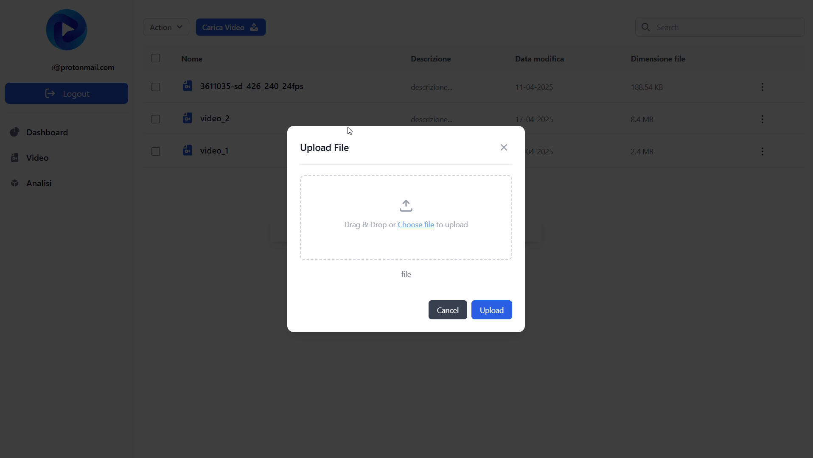
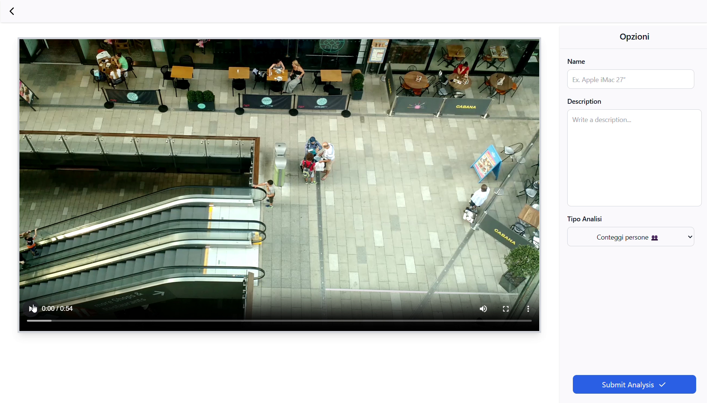
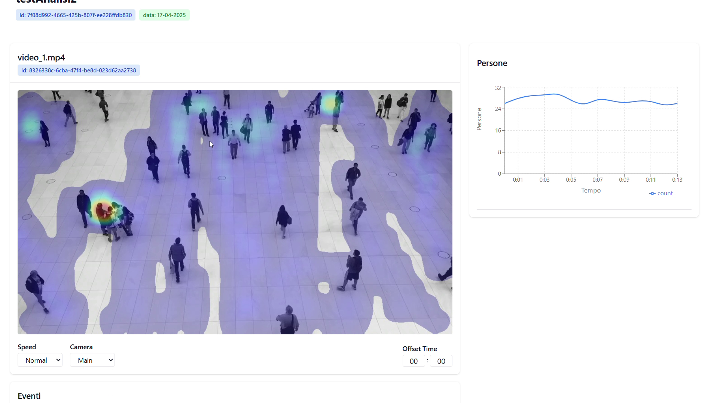
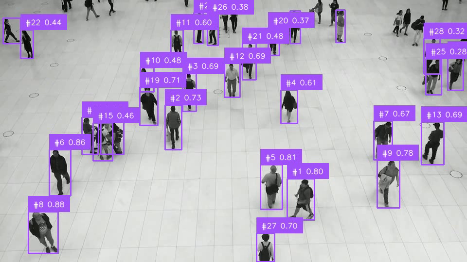

# FishFlow

<div align="center">

**Sistema Cloud SaaS basato su AI per l'Analisi dei Flussi di Persone nelle Attività Commerciali**

[](https://aws.amazon.com/amplify/)
[](https://react.dev/)
[](https://www.typescriptlang.org/)
[](https://www.python.org/)

[Demo Video](#demo) • [Architettura](#architettura) • [Screenshots](#interfaccia) • [Contatti](#contatti)

</div>

---

## Panoramica

FishFlow è una piattaforma cloud-based sviluppata durante il mio tirocinio presso Bagubits, progettata per analizzare i flussi di persone all'interno di spazi commerciali. Il sistema utilizza computer vision e intelligenza artificiale per trasformare video di sorveglianza in dati utili per l'ottimizzazione degli spazi retail, mantenendo il pieno rispetto della privacy (GDPR compliant).

### Il Problema

Nel settore della Grande Distribuzione Organizzata, comprendere il comportamento dei clienti negli spazi fisici è fondamentale ma difficile. Le aziende faticano a ottimizzare il layout dei prodotti e misurare l'efficacia delle strategie di marketing in-store, basandosi spesso su intuizioni piuttosto che su dati concreti.

### La Soluzione

FishFlow elabora i video esistenti dalle telecamere di sorveglianza per fornire:
- Conteggio automatico delle persone
- Mappe di calore dei percorsi più frequentati
- Analisi dei pattern di movimento
- Rilevamento completamente anonimo (nessun dato biometrico)

---

## Demo

### Video Dimostrativo
[Guarda il video demo completo](your-youtube-link) *(3 minuti)*

### Preview Rapida


---

## Architettura

Il sistema è organizzato in tre livelli principali:

```
Frontend (React/TypeScript)
    ↓
Backend Cloud (AWS Services)
    ↓
AI Module (Python/YOLO)
```

**Stack Tecnologico**

*Frontend*
- React 18 con TypeScript
- TailwindCSS per lo styling
- AWS Amplify per hosting e deployment

*Backend*
- AWS Cognito (autenticazione)
- Amazon S3 (storage video)
- DynamoDB (database NoSQL)
- AWS Lambda (funzioni serverless)
- Amazon ECS (orchestrazione container)

*AI/Computer Vision*
- YOLOv8 per object detection
- OpenCV per elaborazione video
- Python 3.13
- Docker per containerizzazione

---

## Interfaccia

### Autenticazione e Dashboard

| Login | Dashboard |
|-------|-----------|
|  |  |

### Gestione Video

| Caricamento | Lista Video | Anteprima |
|------------|-------------|-----------|
|  |  |  |

### Risultati dell'Analisi



**Output generati:**

| Frame Annotati | Mappa di Calore |
|----------------|-----------------|
|  |  |

---

## Caratteristiche Tecniche

### Funzionalità Implementate

- Sistema di autenticazione multi-tenant con AWS Cognito
- Upload e gestione sicura dei video su S3
- Analisi video con rilevamento persone tramite YOLO
- Generazione automatica di mappe di calore
- Dashboard per la gestione dei contenuti
- API GraphQL per l'integrazione dei servizi

### Sfide Tecniche Risolte

**Scalabilità dell'Elaborazione Video**  
L'analisi video richiede risorse computazionali significative. Ho implementato una soluzione basata su container Docker orchestrati da Amazon ECS con auto-scaling, permettendo di processare video da multipli punti vendita in parallelo.

**Privacy e Conformità GDPR**  
Per rispettare le stringenti regolamentazioni europee, il sistema utilizza YOLO per il rilevamento posizionale anonimo, senza alcun tipo di riconoscimento biometrico o memorizzazione di dati identificativi.

**Ottimizzazione dei Costi Cloud**  
L'elaborazione continua avrebbe generato costi elevati. Ho implementato un sistema a trigger manuale combinato con architettura serverless, pagando solo per le risorse effettivamente utilizzate durante l'analisi.

---

## Come Funziona

1. L'utente carica un video di sorveglianza tramite l'interfaccia web
2. Il file viene salvato su Amazon S3 e registrato in DynamoDB
3. L'utente avvia manualmente l'analisi dalla dashboard
4. Un container Docker su ECS elabora il video utilizzando YOLO
5. Vengono generati JSON con coordinate, frame annotati e heatmap
6. I risultati sono disponibili per la visualizzazione nella dashboard

### Esempio di Output JSON

```json
{
  "person_1": [
    [0, 209.8, 969.0, 126.2, 623.4, 0.0],
    [1, 210.1, 969.6, 126.3, 623.5, 0.04]
  ],
}
```
*Formato: [frame, x, y, width, height, timestamp]*

---


## Roadmap

**Versione Attuale (v1.0 - Demo Funzionante)**
- Sistema completo di autenticazione
- Upload e gestione video
- Analisi AI con generazione risultati
- Dashboard base operativa

**Sviluppi Futuri**
- Dashboard analytics interattiva con grafici temporali
- Export automatico di report in PDF/CSV
- Supporto per analisi multi-camera sincronizzata
- Sistema di notifiche real-time
- Analisi predittiva dei flussi


## Contesto Accademico

**Tesi di Laurea Triennale in Informatica**

Università degli Studi di Torino - Dipartimento di Informatica  
Anno Accademico 2024/2025

**Candidato:** Jean Roland Fabrizio Agbonson  
**Relatore:** Prof.ssa Claudia Picardi  
**Azienda:** Bagubits (tirocinio curriculare)

---

## Note

Questo progetto rappresenta una versione dimostrativa funzionante sviluppata come tesi di laurea. Per l'utilizzo è necessario un account AWS configurato con i servizi richiesti. Il sistema è progettato con un'architettura modulare che permette future estensioni e ottimizzazioni per un eventuale utilizzo in produzione.

---

## Contatti

**Jean Roland Fabrizio Agbonson**

[](https://github.com/smilefabri)
[]([your-linkedin-url](https://www.linkedin.com/in/fabrizio-agbonson-1b7960234/))
[](mailto:fabriagbonson@gmail.com)

---

## Ringraziamenti

Ringrazio la Prof.ssa Claudia Picardi per la supervisione accademica, il team di Bagubits per l'opportunità di tirocinio e la fiducia, e la community open source per gli strumenti utilizzati nello sviluppo di questo progetto.

---

<div align="center">

Se questo progetto ti interessa, lascia una stella su GitHub

**Sviluppato per innovare il settore retail attraverso l'intelligenza artificiale**

</div>