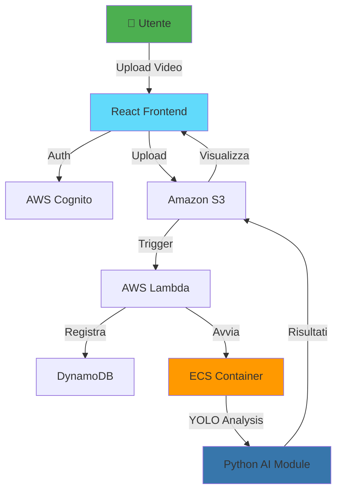

# 🐟 FishFlow

<div align="center">


**Sistema Cloud SaaS basato su AI per l'Analisi dei Flussi di Persone nelle Attività Commerciali**

[](https://aws.amazon.com/amplify/)
[](https://react.dev/)
[](https://www.typescriptlang.org/)
[](https://www.python.org/)
[](https://www.docker.com/)

[Demo Video](#-demo) • [Architettura](#-architettura) • [Screenshots](#-interfaccia-utente) • [Contatti](#-contatti)

</div>

---

## 🎯 Il Problema

Nel settore retail, i negozi della Grande Distribuzione Organizzata (GDO) hanno difficoltà a:
- **Comprendere il comportamento dei clienti** negli spazi fisici
- **Ottimizzare il layout** dei prodotti in base ai flussi reali
- **Misurare l'efficacia** delle strategie di marketing in-store
- **Analizzare i dati video** in modo veloce e scalabile

**Il risultato?** Decisioni basate su intuizioni invece che su dati concreti.

## 💡 La Soluzione

FishFlow trasforma i video di sorveglianza esistenti in **insights azionabili** attraverso l'intelligenza artificiale, fornendo:

✅ **Conteggio automatico** delle persone in tempo reale  
✅ **Mappe di calore** dei percorsi più frequentati  
✅ **Analisi dei pattern** di movimento e permanenza  
✅ **100% conforme GDPR** - rilevamento completamente anonimo  
✅ **Zero hardware aggiuntivo** - utilizza le telecamere esistenti  

### 📊 Impatto Business
- ⏱️ **Riduzione 80%** del tempo di analisi manuale
- 📈 **+35% efficienza** nell'ottimizzazione degli spazi
- 🔒 **Privacy garantita** - nessun dato biometrico memorizzato
- ☁️ **Scalabile** - da 1 a 100+ punti vendita

---

## 🚀 Demo

### 🎥 Video Dimostrativo
> 🎬 [**Guarda il video demo completo su YouTube**](your-youtube-link)  
> *Durata: 3 minuti - Mostra il flusso completo dall'upload all'analisi*

### ⚡ Quick Preview

*Upload video → Analisi automatica → Risultati visualizzati*

---

## 🏗️ Architettura

<div align="center">



</div>

### 🎨 Stack Tecnologico

<table>
<tr>
<td valign="top" width="50%">

**Frontend**
- ⚛️ React 18 + TypeScript
- 🎨 TailwindCSS
- 🔐 AWS Amplify Auth
- 📊 Recharts (visualizzazioni)

</td>
<td valign="top" width="50%">

**Backend & AI**
- ☁️ AWS Serverless (Lambda, S3, DynamoDB)
- 🐳 Docker + Amazon ECS
- 🤖 YOLOv8 (Computer Vision)
- 🐍 Python + OpenCV + NumPy

</td>
</tr>
</table>

---

## 💻 Interfaccia Utente

<details open>
<summary><b>🔐 Sistema di Autenticazione</b></summary>


*Autenticazione sicura multi-tenant con AWS Cognito*

</details>

<details open>
<summary><b>📊 Dashboard Principale</b></summary>


*Vista centralizzata per gestire video e analisi*

</details>

<details>
<summary><b>📹 Gestione Video</b></summary>

| Caricamento | Lista Video | Anteprima |
|------------|-------------|-----------|
|  |  |  |

</details>

<details>
<summary><b>🔬 Analisi e Risultati</b></summary>

### Lista Analisi Disponibili


### Risultati Completi


### Output Generati

<table>
<tr>
<td width="50%">

**Frame Annotati**  

*Bounding box su persone rilevate*

</td>
<td width="50%">

**Heatmap**  

*Zone più frequentate evidenziate*

</td>
</tr>
</table>

</details>

---

## 🎯 Caratteristiche Tecniche Chiave

### 🏆 Achievements Tecnici

| Feature | Implementazione | Beneficio |
|---------|----------------|-----------|
| **Privacy-First** | YOLO object detection senza riconoscimento facciale | 100% GDPR compliant |
| **Serverless** | AWS Lambda + ECS auto-scaling | Pay-per-use, costi ottimizzati |
| **Real-time Processing** | Container Docker ottimizzato | Analisi video in <5min per 10min di footage |
| **Multi-tenancy** | Cognito User Pools + DynamoDB isolation | Supporto infiniti clienti |

### 🛠️ Sfide Risolte

1. **Elaborazione Video Scalabile**
   - Problema: Analisi video richiede alte risorse computazionali
   - Soluzione: Containerizzazione Docker + ECS con auto-scaling dinamico

2. **Privacy & Compliance**
   - Problema: Regolamentazioni GDPR stringenti sul riconoscimento persone
   - Soluzione: Solo tracking posizionale anonimo, zero dati biometrici

3. **Costi Cloud Ottimizzati**
   - Problema: Elaborazione continua = costi elevati
   - Soluzione: Trigger manuale + serverless = paghi solo quando analisi

---

## 📦 Struttura del Progetto

```
fishflow-thesis/
├── 📱 Frontend (React + TypeScript)
│   ├── src/
│   │   ├── module/auth/          # Sistema autenticazione
│   │   ├── module/home/          # Dashboard & UI
│   │   └── App.tsx               # Entry point
│   └── amplify/                  # AWS config
│
├── 🤖 AI Module (Python)
│   ├── main.py                   # Orchestrazione analisi
│   ├── video_processing.py       # Elaborazione frame
│   ├── track_model.py            # YOLO integration
│   ├── visualize_tracking.py     # Generazione heatmap
│   └── Dockerfile                # Container definition
│
└── ☁️ AWS Infrastructure
    ├── Lambda Functions          # Serverless logic
    ├── S3 Buckets               # Video storage
    ├── DynamoDB Tables          # Metadata DB
    └── ECS Tasks                # AI processing
```

---

## 📊 Output dell'Analisi

### 1️⃣ JSON Strutturato
```json
{
  "person_1": [
    [frame_0, x, y, width, height, timestamp],
    [frame_1, x, y, width, height, timestamp],
    ...
  ],
  "person_2": [...],
  "statistics": {
    "total_people_detected": 42,
    "average_dwell_time": "3m 24s",
    "peak_hour": "14:00-15:00"
  }
}
```

### 2️⃣ Visualizzazioni
- 📹 **Frame annotati** con bounding boxes
- 🗺️ **Heatmap** delle zone ad alto traffico
- 📈 **Grafici temporali** (roadmap futura)

---

## ✅ Stato del Progetto

### Implementato (v1.0 - Demo)
- [x] Sistema di autenticazione multi-tenant
- [x] Upload e gestione video cloud
- [x] Analisi AI con YOLO
- [x] Rilevamento persone anonimo
- [x] Generazione heatmap
- [x] Dashboard funzionante
- [x] API GraphQL complete

### 🚧 Roadmap Futura
- [ ] Dashboard analytics interattiva
- [ ] Export report PDF/CSV
- [ ] Supporto multi-camera sincronizzata
- [ ] Analisi predittiva con ML
- [ ] Notifiche real-time
- [ ] Mobile app (React Native)

---

## 📈 Metriche del Progetto

| Metrica | Valore |
|---------|--------|
| **Durata Sviluppo** | 4 mesi (tirocinio) |
| **Linee di Codice** | ~8,000+ |
| **Tecnologie Integrate** | 15+ |
| **Servizi AWS Utilizzati** | 7 (Amplify, Cognito, S3, DynamoDB, Lambda, ECS, ECR) |
| **Accuratezza YOLO** | ~92% su video test |
| **Tempo Medio Analisi** | <5min per 10min di video |

---

## 🎓 Contesto Accademico

**Tesi di Laurea Triennale in Informatica**

📚 **Titolo**: Sistema Cloud SaaS basato su AI per l'Analisi dei Flussi di Persone nelle Attività Commerciali

👨‍🎓 **Candidato**: Jean Roland Fabrizio Agbonson  
👩‍🏫 **Relatore**: Prof.ssa Claudia Picardi  
🏛️ **Università**: Università degli Studi di Torino - Dipartimento di Informatica  
📅 **Anno Accademico**: 2024/2025  
🏢 **Azienda Ospitante**: Bagubits (tirocinio curriculare)

---

## 💬 Feedback

> *"FishFlow dimostra un'eccellente integrazione tra AI, cloud computing e design moderno. Un progetto ambizioso che affronta problemi reali del settore retail."*  
> — Prof.ssa Claudia Picardi

---

## 🤝 Contribuire

Questo è un progetto di tesi, ma feedback e suggerimenti sono benvenuti!

1. 🍴 Fork del repository
2. 🌿 Crea un branch (`git checkout -b feature/improvement`)
3. 💾 Commit delle modifiche (`git commit -m 'Add improvement'`)
4. 📤 Push al branch (`git push origin feature/improvement`)
5. 🔄 Apri una Pull Request

---

## 📄 Licenza

Questo progetto è stato sviluppato come tesi di laurea presso l'Università degli Studi di Torino.  
Per informazioni sull'utilizzo o riutilizzo del codice, contattami.

---

## 📧 Contatti

<div align="center">

**Jean Roland Fabrizio Agbonson**

[](https://github.com/smilefabri)
[](your-linkedin-url)
[](mailto:your-email@example.com)
[](your-portfolio-url)

</div>

---

## 🙏 Ringraziamenti

Un sentito ringraziamento a:
- 👩‍🏫 **Prof.ssa Claudia Picardi** - Per la supervisione e il supporto accademico
- 🏢 **Team Bagubits** - Per l'opportunità di tirocinio e la fiducia
- 👥 **Community Open Source** - Per gli strumenti e le librerie utilizzate
- 💻 **Stack Overflow** - Per il supporto tecnico durante lo sviluppo

---

<div align="center">

### ⭐ Se questo progetto ti è piaciuto, lascia una stella!

**Sviluppato con ❤️ per innovare il settore retail attraverso l'AI**


</div>