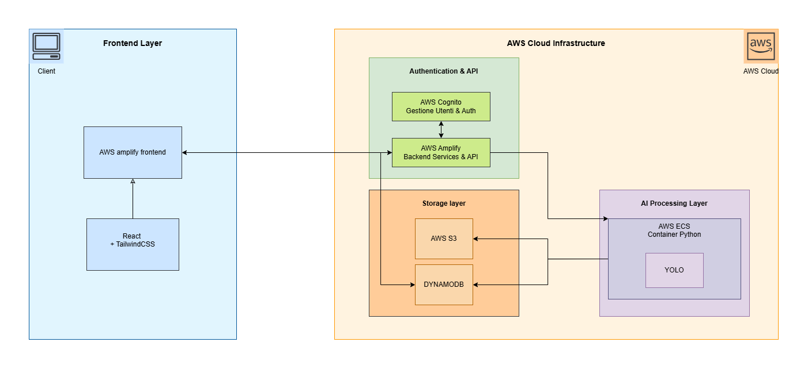
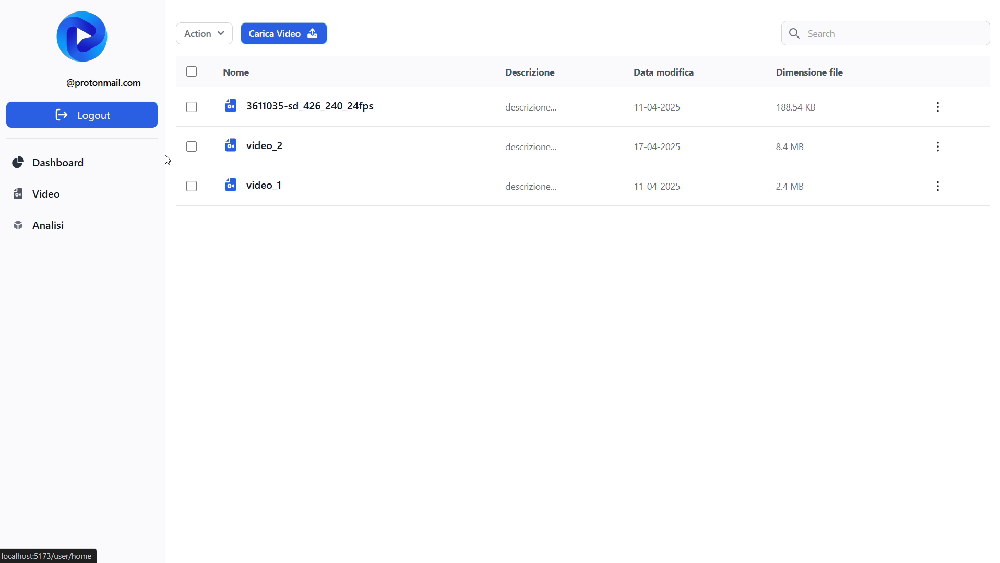
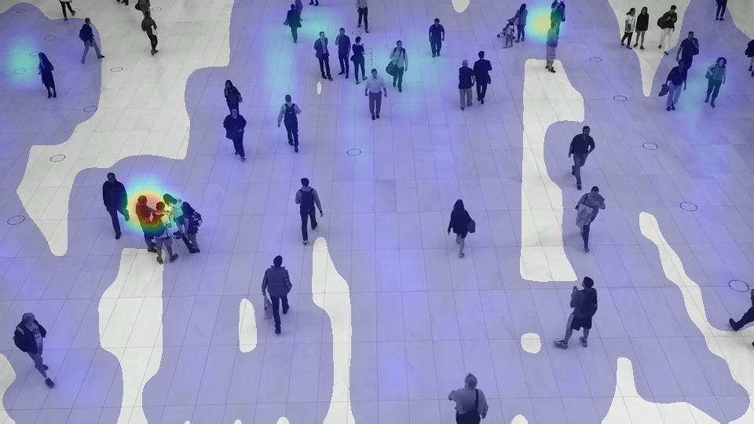

*[English version](README.md) | [Versione italiana](README_IT.md)*
# FishFlow

<div align="center">

**AI-Powered Cloud SaaS Platform for People Flow Analysis in Retail Environments**

[](https://aws.amazon.com/amplify/)
[](https://react.dev/)
[](https://www.typescriptlang.org/)
[](https://www.python.org/)

[Demo Video](#demo) • [Architecture](#architecture) • [Screenshots](#interface) • [Contact](#contact)

</div>

---

## Overview

FishFlow is a cloud-based platform developed during my internship at Bagubits, designed to analyze people flow within commercial spaces. The system uses computer vision and artificial intelligence to transform surveillance footage into actionable insights for retail space optimization, while maintaining full privacy compliance (GDPR compliant).

### The Problem

In the retail sector, understanding customer behavior in physical spaces is crucial but challenging. Companies struggle to optimize product layouts and measure the effectiveness of in-store marketing strategies, often relying on intuition rather than concrete data.

### The Solution

FishFlow processes existing surveillance camera footage to provide:
- Automatic people counting
- Heatmaps of most frequented paths
- Movement pattern analysis
- Completely anonymous detection (no biometric data)

---

## Demo

### Demo Video
[Watch full demo video]() 


---

## Architecture

The system is organized in three main layers:



**Technology Stack**

*Frontend*
- React 18 with TypeScript
- TailwindCSS for styling
- AWS Amplify for hosting and deployment

*Backend*
- AWS Cognito (authentication)
- Amazon S3 (video storage)
- DynamoDB (NoSQL database)
- AWS Lambda (serverless functions)
- Amazon ECS (container orchestration)

*AI/Computer Vision*
- YOLOv8 for object detection
- OpenCV for video processing
- Python 3.13
- Docker for containerization

---

## Interface

### Authentication and Dashboard

| Login | Dashboard |
|-------|-----------|
|  |  |

### Gestione Video

| Caricamento | Lista Video | Anteprima |
|------------|-------------|-----------|
|  |  |  |

### Risultati dell'Analisi


**Output generati:**

| Frame Annotati | Mappa di Calore |
|----------------|-----------------|
|  |  |

---

## Technical Features

### Implemented Functionality

- Multi-tenant authentication system with AWS Cognito
- Secure video upload and management on S3
- Video analysis with people detection using YOLO
- Automatic heatmap generation
- Content management dashboard
- GraphQL API for service integration

### Technical Challenges Solved

**Video Processing Scalability**  
Video analysis requires significant computational resources. I implemented a solution based on Docker containers orchestrated by Amazon ECS with auto-scaling, enabling parallel processing of videos from multiple stores.

**Privacy and GDPR Compliance**  
To meet strict European regulations, the system uses YOLO for anonymous positional detection, without any biometric recognition or storage of identifying data.

**Cloud Cost Optimization**  
Continuous processing would generate high costs. I implemented a manual trigger system combined with serverless architecture, paying only for resources actually used during analysis.

---

## How It Works

1. User uploads a surveillance video through the web interface
2. File is saved to Amazon S3 and registered in DynamoDB
3. User manually starts analysis from the dashboard
4. A Docker container on ECS processes the video using YOLO
5. JSON with coordinates, annotated frames, and heatmaps are generated
6. Results are available for viewing in the dashboard

### Sample JSON Output

```json
{
  "person_1": [
    [0, 209.8, 969.0, 126.2, 623.4, 0.0],
    [1, 210.1, 969.6, 126.3, 623.5, 0.04]
  ],
  "statistics": {
    "total_people_detected": 42,
    "average_dwell_time": "3m 24s"
  }
}
```
*Format: [frame, x, y, width, height, timestamp]*


---

## Roadmap

**Current Version (v1.0 - Working Demo)**
- Complete authentication system
- Video upload and management
- AI analysis with result generation
- Operational base dashboard

**Future Development**
- Interactive analytics dashboard with temporal graphs
- Automatic report export in PDF/CSV
- Support for synchronized multi-camera analysis
- Real-time notification system
- Predictive flow analysis


---

## Academic Context

**Bachelor's Thesis in Computer Science**

University of Turin - Department of Computer Science  
Academic Year 2024/2025

**Candidate:** Jean Roland Fabrizio Agbonson  
**Supervisor:** Prof. Claudia Picardi  
**Company:** Bagubits (curricular internship)

---

## Notes

This project represents a working demo version developed as a bachelor's thesis. Usage requires an AWS account configured with the required services. The system is designed with a modular architecture that allows for future extensions and optimizations for potential production use.

---

## Contact

**Jean Roland Fabrizio Agbonson**

[](https://github.com/smilefabri)
[]([your-linkedin-url](https://www.linkedin.com/in/fabrizio-agbonson-1b7960234/))
[](mailto:fabriagbonson@gmail.com)


---

## Acknowledgments

I thank Prof. Claudia Picardi for academic supervision, the Bagubits team for the internship opportunity and trust, and the open source community for the tools used in developing this project.

---

<div align="center">

If you find this project interesting, leave a star on GitHub

**Developed to innovate the retail sector through artificial intelligence**

</div>